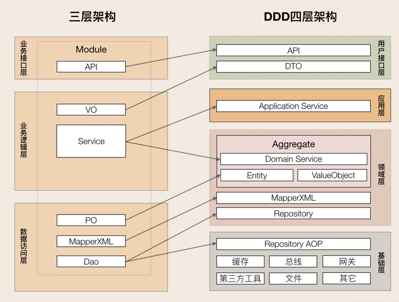

### 项目结构划分
- interfaces层包含用户的接口web服务等
  - facade提供粗力度调用接口
  - dto数据传输载体，与应用层用户端数据交互
- application应用层负责服务的组合，编排，转发，转换和传递，应用层主要是DO,基础层为PO
- domain领域层，聚合根，实体，值对象，领域对象，实现核心业务逻辑，保证业务正确性，代码模型：entity\event\repository\service子目录
- infrastructure基础层，基础服务：三方工具/驱动/MQ/API网关/文件/缓存/DB,分包：config配置信息，util连接工具
